# Primera practica integradora

  

  
  

## Descripción del Proyecto

  

Este proyecto es el backend de una tienda en linea, la cual posee productos, carritos y un chat en vivo.


  
  

## Cómo Levantar el Proyecto

Para poder ejecutar este proyecto en tu máquina local, sigue estos pasos:

1.  **Clonar el Repositorio:** Abre una terminal y ejecuta el siguiente comando para clonar este repositorio en tu máquina local: ```bash git clone https://github.com/NicolasEsquilache/PracticaIntegradora```

  

2.  **Instalar Dependencias:** En la terminal, navega hasta la carpeta del proyecto y ejecuta los siguientes comandos para instalar todas las dependencias necesarias:

  

`cd practicaIntegradora`

` npm install`

  

Asegúrate de que Node.js esté instalado en tu sistema antes de ejecutar este comando.

  


4.**Ejecutar la Aplicación:** Una vez que hayas clonado el repositorio, instalado las dependencias y configurado las variables de entorno, puedes ejecutar la aplicación con el siguiente comando:

` node src/app.js`

  

## Capturas
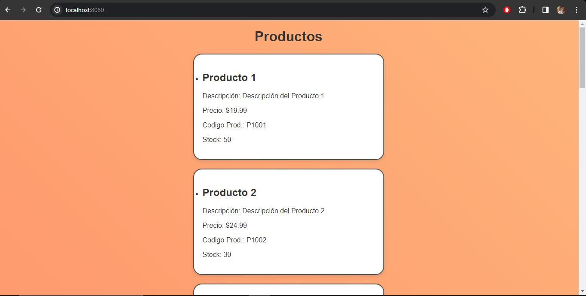
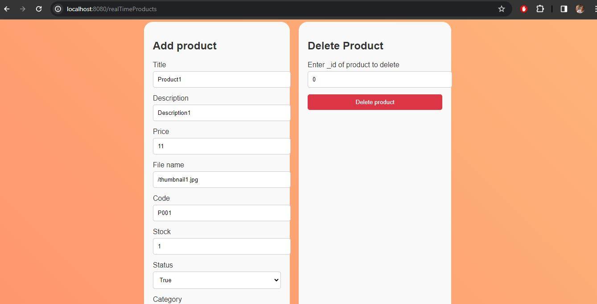
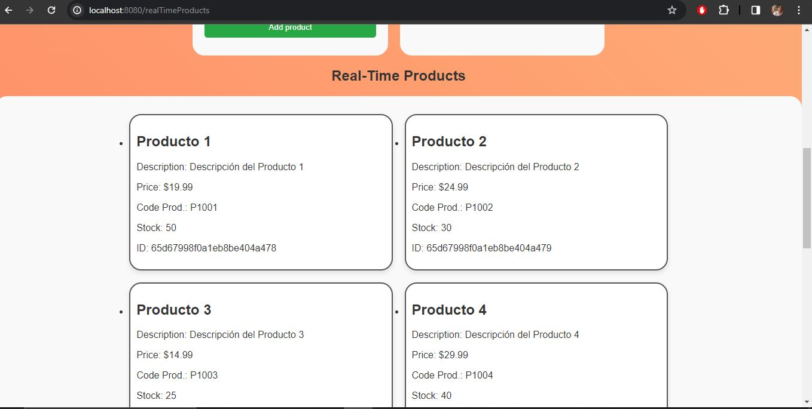

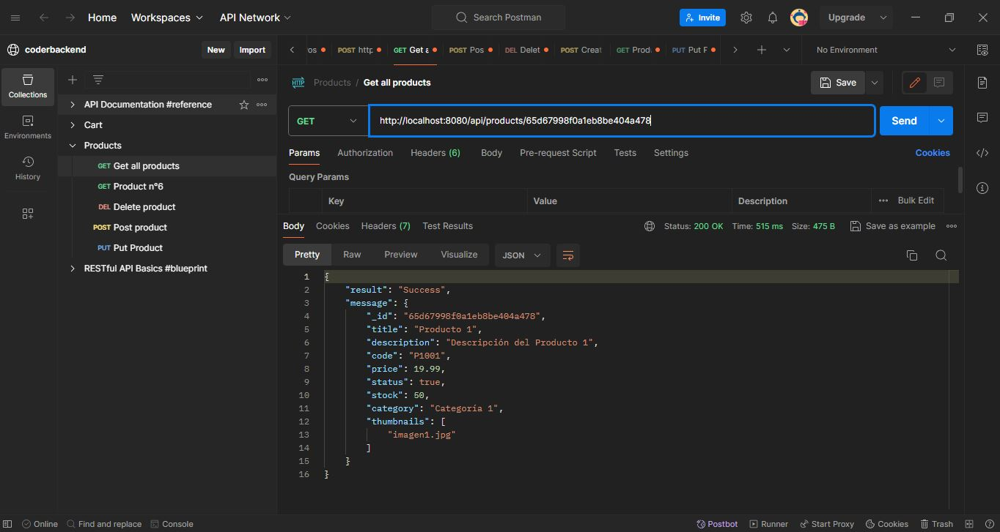
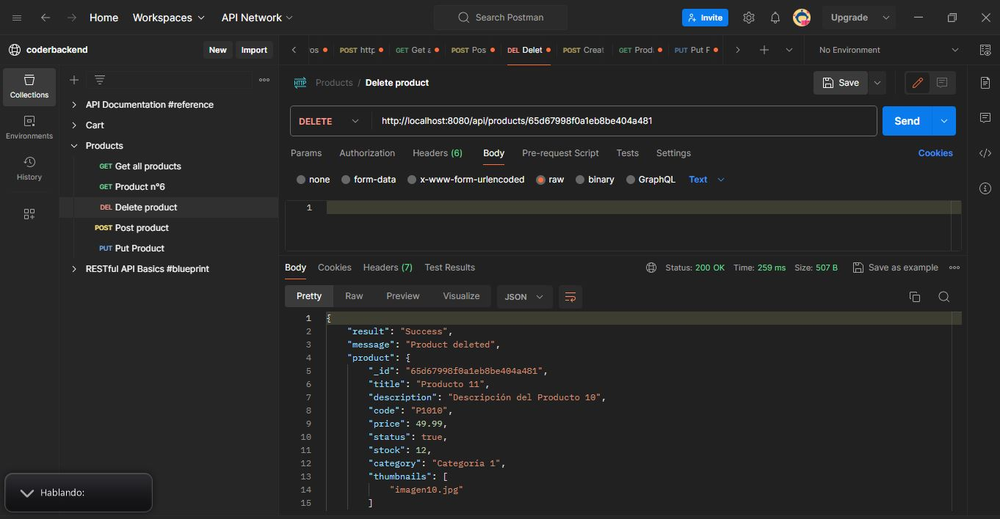
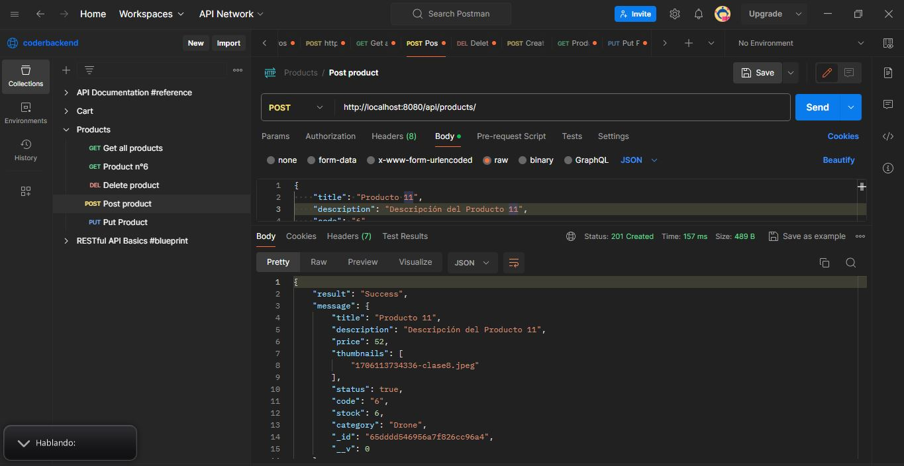
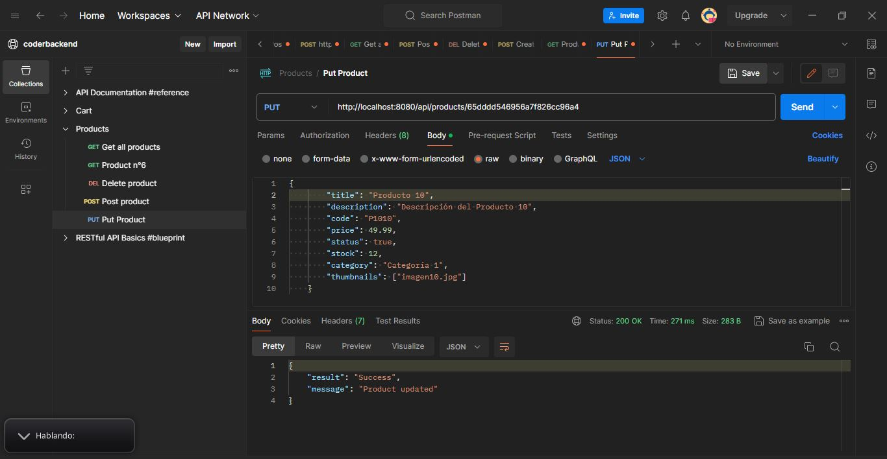
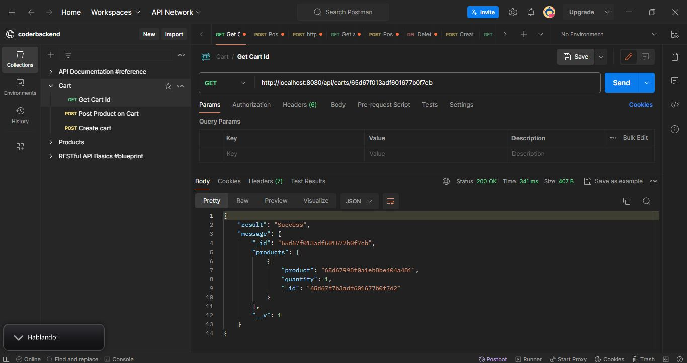
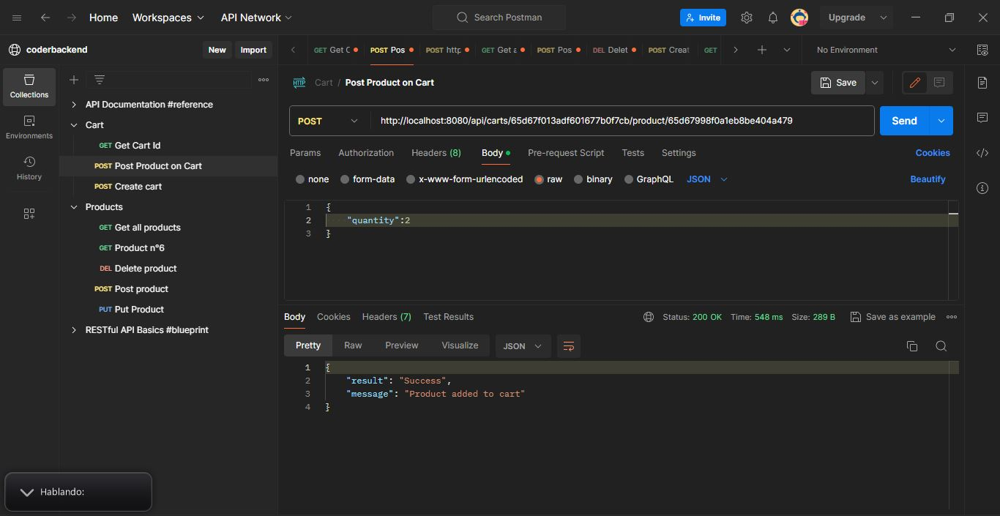
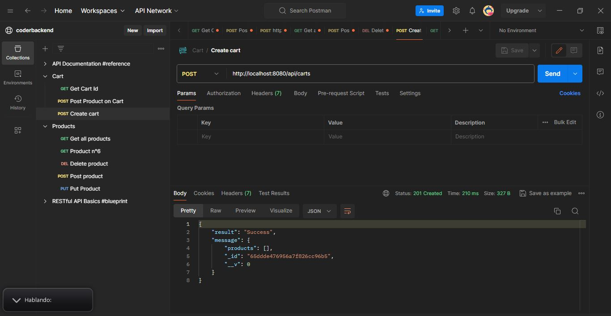
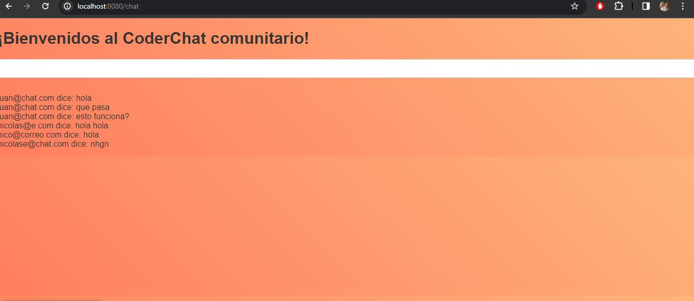
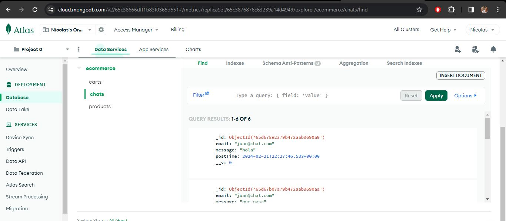

## Dependencias usadas

 - Express
 - Express-handlebars
 - Mongoose
 - Socket.io
